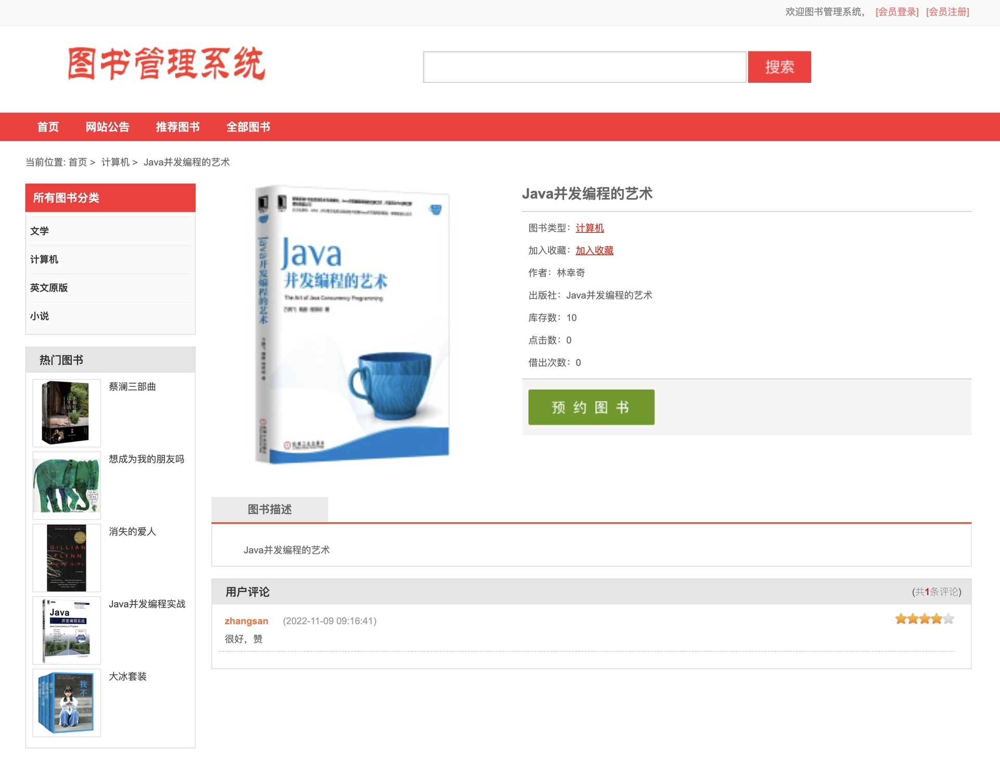
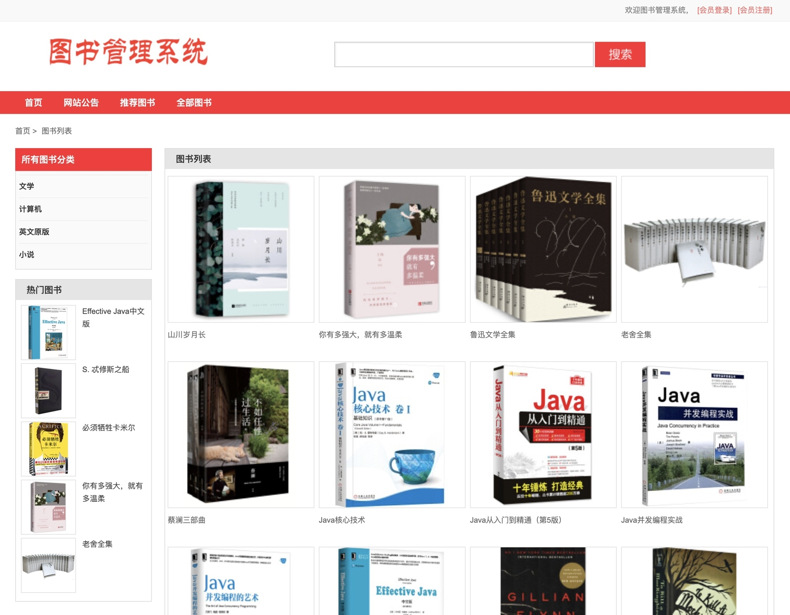
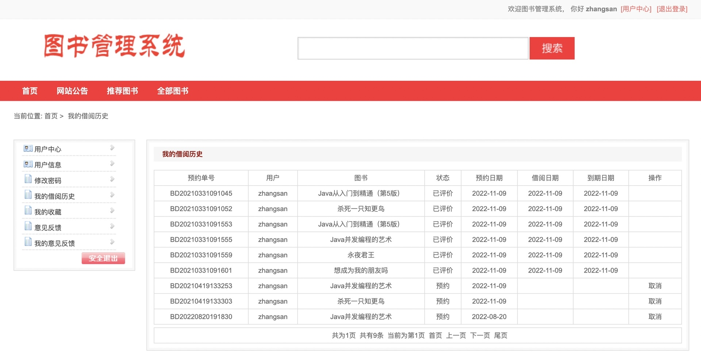
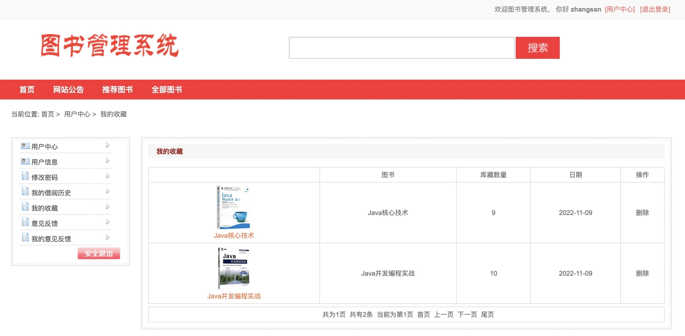
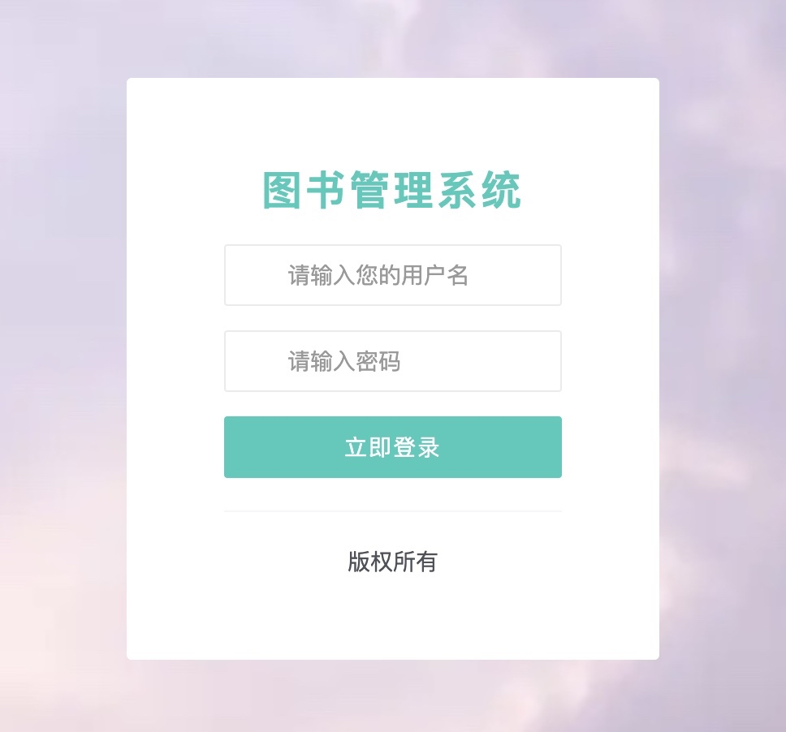
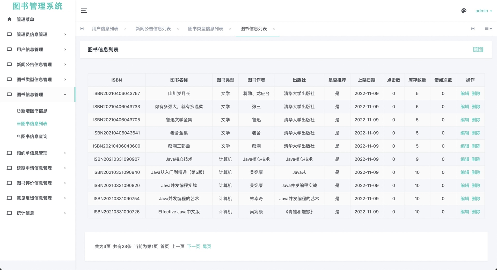

基于Springboot的图书管理系统
=
### 完整代码获取地址：从戎源码网 ([https://armycodes.com/](https://armycodes.com/))
### 作者微信：19941326836  QQ：952045282 
### 承接计算机毕业设计、Java毕业设计、Python毕业设计、深度学习、机器学习
### 选题+开题报告+任务书+程序定制+安装调试+论文+答辩ppt 一条龙服务
### 所有选题地址https://github.com/nature924/allProject

一、项目介绍
---
本项目是一套基于SpringBoot的图书管理系统，主要包含两种角色：读者和管理员，主要功能如下
### 读者只能对个人信息的查阅、修改，图书的查询，而管理员则可以进行图书信息及借阅信息的管理。

（1）系统登录。分为普通读者登录和管理员登录。
（2）系统管理。系统管理包括管理员设置，以及图书类别设置。管理员设置包括管理员信息的设置以及密码的设置。图书类别的设置只有管理员才可以对他进行新增，修改和删除。
（3）图书管理。包括图书信息管理，图书信息查询。只有管理员才可以对图书进行管理，图书查询是帮助读者方便查找图书信息。
（4）读者管理。读者管理包括读者信息管理，以及读者信息的查询。读者信息查询可以根据读者的姓名和编号进行查询。读者信息管理只对管理员有用，只有管理员可以添加读者，修改和删除读者的信息。
（5）图书借阅管理。图书借阅包括图书的借阅，归还以及续借。图书的借阅以及归还只对管理员起作用，只有通过管理员才可以进行图书的借阅以及归还。读者只能对图书进行续借的操作。

二、项目技术
---
- 编程语言：Java
- 数据库：MySQL
- 项目管理工具：Maven
- 前端技术：VUE、HTML、Jquery、Bootstrap
- 后端技术：Spring、SpringMVC、MyBatis

三、运行环境
---
- 操作系统：Windows、macOS都可以
- JDK版本：JDK1.8以上都可以
- 开发工具：IDEA、Ecplise、Myecplise都可以
- 数据库: MySQL5.7以上都可以
- Tomcat：任意版本都可以
- Maven：任意版本都可以

四、运行截图
---
### 论文截图：

### 程序截图：

